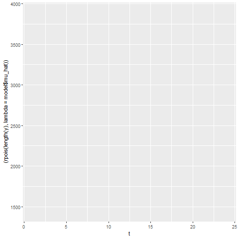

# poisson-glm
Custom implementation of a Poisson GLM with Elastic Net regularization and gradient-based optimization

## Problem

A classical linear regression produced invalid predictions (negative crime rates), 
which is inconsistent with count data nature of the dependent variable.

The goal was to model crime rates using a statistically appropriate framework 
while addressing multicollinearity and heteroskedasticity.

## Why Poisson GLM?

Crime rates represent count-type data per population unit, which is exactly what poisson distribution describes. 
A Poisson GLM with log link ensures:

- Non-negative predictions    
- Variance proportional to the mean

## What was implemented

Instead of using built-in GLM functions, the model was implemented from scratch:

- Log-likelihood function for Poisson GLM  
- Elastic Net regularization  
- Gradient descent with Nesterov momentum  
- Numerical gradient approximation  
- Fisher Information Matrix for inference  
- Standard errors and p-values for coefficients

## Data

The dataset contains annual socioeconomic and law enforcement indicators:

- Wage level  
- Unemployment  
- Crime clearance rate  
- Police officers per 100,000 population  
- Crime rate (target variable)

## Results

The Poisson GLM produced stable, non-negative predictions and statistically 
interpretable coefficients.

Key findings:

- All independent variables are significant on level of 0.05
- Without regularization, result is ininterpretable due to multicolinearity
- Elastic Net regularization stabilized estimates, acurate l1 and l2 hyperparameters are supposed to be choosen by cross-validation

## Simulation of Crime Events

Using the estimated Poisson intensity, multiple crime paths were simulated 
to visually illustrate variability and construct empirical confidence intervals. 

